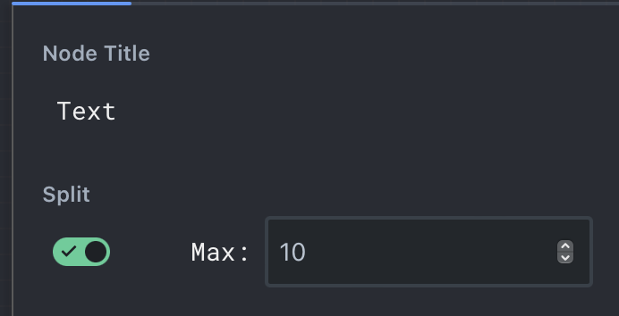

Splitting a node is a powerful tool for parallelizing execution. Change a node to a Split node by toggling on Split on any node:

When a node is split:

- The node will be executed N times, in parallel
- The input types for the input ports of the node can be arrays of the same type of data that would normally be accepted by the node
- The output types for the output ports of the node will be arrays of data of the same type that would normally be output by the node
- Each execution of the node will be given a single value from the array of data, and executed normally. The output of each execution will be collected into an array, and the array will be output from the node.
- If the input value is not an array, then every execution of the node will be given the same value.
- If multiple values are arrays, then the values will be zipped together for each execution. For example, if one port is given a (string, string), and another port a (number, number), then each execution will be given a (string, number) as its inputs.

## Use Cases

Splitting is most useful for parallelizing execution. For example, you could use a [Read Directory Node](../node-reference/read-directory) to read a directory of files. This gives an array of strings. You can then pipe this into a [Read File Node](../node-reference/read-file) which has Split turned on, to read each file in parallel. The output of the Read File node will be an array of strings.

## Chaining

The most powerful feature of splitting is its ability to chain splits.

For the above example, the Read File could then be piped into a split [Text Node](../node-reference/text), to interpolate the contents of each file into another string. The split Text node can then be piped into a split [Chat Node](../node-reference/chat), to send each file's contents to a chatbot in parallel. The output of the Chat node will be an array of strings, giving you the response from the AI for each file.

## Joining

At some point you will likely wish to join split nodes back into non-split nodes. There are a few ways to accomplish this.

- When an array of strings is passed into a [Text Node](../node-reference/text) or a [Prompt Node](../node-reference/prompt), the node will join the array of strings into a single string, separated by newlines. This is the most common method of joining.
- The [Chat Node](../node-reference/chat) can accept an array of strings or chat messages to its Prompt input.
- The [Extract Object Path](../node-reference/extract-object-path) node can be used to extract a single value from an array of objects.
- The [Pop Node](../node-reference/pop) node can be used to extract a single value from an array of any type.
- The [Code Node](../node-reference/code) node can be used to write custom code to join arrays of data, such as using the [Array.prototype.reduce](https://developer.mozilla.org/en-US/docs/Web/JavaScript/Reference/Global_Objects/Array/Reduce) function.

## Nested Splitting and Arrays of Arrays

Nested splitting and arrays of arrays are **not supported**. However, this can be partially worked around by using a split [Subgraph Node](../node-reference/subgraph). Since the subgraph is split, the graph itself will be executed multiple times in parallel. The subgraph can then contain more nodes with splitting turned on, effectively allowing for nested splitting to any degree. However do be careful with excessive splitting, or recursive splitting that may cause infinite loops.
